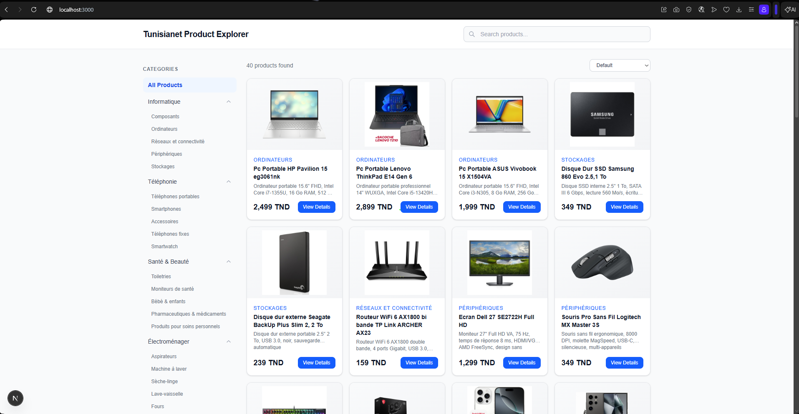
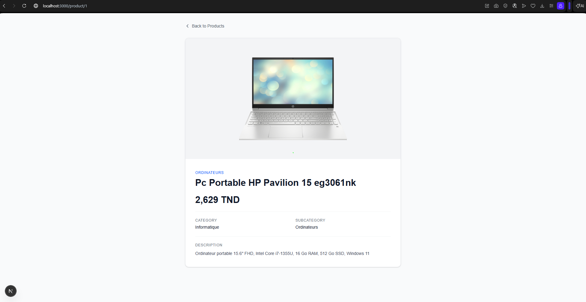

# Tunisianet Product Explorer

A product catalog web application . It displays a curated list of products inspired by Tunisianet with search, filtering, and sorting capabilities.

The main objective is to demonstrate a full-stack architecture with a **Go + Echo** REST API backend and a **Next.js + TypeScript + Tailwind CSS** frontend, communicating over HTTP.

## Screenshots

### Homepage



### Product Details



## Features

- **Homepage** – Landing page with a responsive product card grid
- **Product Listing** – Displays 40 products with image, name, price, and description
- **Search** – Real-time client-side filtering by product name, description, category, or subcategory
- **Category Filtering** – Sidebar with collapsible category groups (Informatique, Téléphonie, Santé & Beauté, Électroménager)
- **Subcategory Filtering** – Drill down into specific subcategories within each category
- **Price Sorting** – Sort products by price ascending or descending
- **Product Details Page** – Dedicated page (`/product/[id]`) with full product information
- **Backend REST API** – Go/Echo server exposing endpoints for product retrieval and search
- **Loading States** – Animated spinner while fetching data
- **Error States** – Error message with retry button when the API is unreachable
- **Responsive Design** – Mobile-friendly layout with collapsible sidebar navigation

## Architecture

```
┌─────────────────────────────────────────────────────┐
│                   Frontend (Next.js)                │
│  TypeScript · React · Tailwind CSS                  │
│  Port 3000                                          │
│                                                     │
│  ┌───────────┐  ┌──────────────┐  ┌──────────────┐  │
│  │  Homepage │  │  Product     │  │  Product     │  │
│  │  (page)   │  │  Detail Page │  │  Service     │  │
│  └─────┬─────┘  └──────┬───────┘  │  (api.ts)    │  │
│        │               │          └──────┬───────┘  │
│        └───────┬───────┘                 │          │
│                │                         │          │
│                └─────────┬───────────────┘          │
│                          │                          │
│                    HTTP / JSON                      │
└──────────────────────────┬──────────────────────────┘
                           │
                           ▼
┌─────────────────────────────────────────────────────┐
│                Backend API (Go + Echo)              │
│  Port 8080                                          │
│                                                     │
│  ┌──────────┐  ┌──────────┐  ┌──────────┐           │
│  │  Routes  │  │ Handlers │  │ Services │           │
│  │ routes.go│  │ health.go│  │product.go│           │
│  │          │  │product.go│  │ (in-mem  │           │
│  │          │  │search.go │  │  store)  │           │
│  └────┬─────┘  └────┬─────┘  └────┬─────┘           │
│       │              │             │                │
│       └──────────────┴─────────────┘                │
│                         │                           │
│                         ▼                           │
│                 Product Data                        │
│              (hardcoded slice)                      │
└─────────────────────────────────────────────────────┘
```

## Project Structure

```
mini-project/
├── main.go                          # Entry point, Echo server setup
├── go.mod                           # Go module definition
├── go.sum                           # Dependency checksums
├── handlers/
│   ├── health.go                    # GET /health handler
│   ├── product.go                   # GET /products/:id handler
│   └── search.go                    # GET /search handler
├── models/
│   └── product.go                   # Product struct definition
├── routes/
│   └── routes.go                    # Route registration
├── services/
│   └── product.go                   # Business logic & in-memory data
└── frontend/
    ├── .gitignore
    ├── package.json
    ├── next.config.ts
    ├── tsconfig.json
    ├── eslint.config.mjs
    ├── postcss.config.mjs
    ├── public/
    │   ├── file.svg
    │   ├── globe.svg
    │   ├── next.svg
    │   ├── vercel.svg
    │   └── window.svg
    └── src/
        ├── app/
        │   ├── globals.css           # Global styles + Tailwind import
        │   ├── layout.tsx            # Root layout with metadata
        │   ├── page.tsx              # Homepage (product grid + sidebar)
        │   ├── favicon.ico
        │   └── product/
        │       └── [id]/
        │           └── page.tsx      # Product detail page
        ├── data/
        │   └── mockProducts.ts       # Product type definitions and category groups
        └── services/
            └── api.ts                # API client functions
```

## API Endpoints

### `GET /health`

Returns the server health status.

**Example response:**

```json
{
  "status": "ok"
}
```

---

### `GET /search`

Retrieves products. Without the `q` parameter, returns all products. With `q`, filters products by name, description, category, or subcategory.

**Query parameters:**

| Parameter | Type   | Required | Description                     |
| --------- | ------ | -------- | ------------------------------- |
| `q`       | string | No       | Search query (case-insensitive) |

**Example request:**

```
GET /search?q=iphone
```

**Example response:**

```json
[
  {
    "id": 11,
    "name": "Apple iPhone 16 Pro Max 5G",
    "price": 4999,
    "category": "Téléphonie",
    "subcategory": "Smartphones",
    "description": "Smartphone Apple A18 Pro, écran 6.9\" OLED 120 Hz, 256 Go stockage, triple appareil photo 48 Mpx, Titanium",
    "image": "https://www.tunisianet.com.tn/419629-large/apple-iphone-16-pro-max-5g-256-go-blanc-titanium.jpg"
  }
]
```

---

### `GET /products/:id`

Returns a single product by its ID.

**Path parameters:**

| Parameter | Type | Required | Description |
| --------- | ---- | -------- | ----------- |
| `id`      | int  | Yes      | Product ID  |

**Example request:**

```
GET /products/1
```

**Example response:**

```json
{
  "id": 1,
  "name": "Pc Portable HP Pavilion 15 eg3061nk",
  "price": 2499,
  "category": "Informatique",
  "subcategory": "Ordinateurs",
  "description": "Ordinateur portable 15.6\" FHD, Intel Core i7-1355U, 16 Go RAM, 512 Go SSD, Windows 11",
  "image": "https://www.tunisianet.com.tn/391244-large/pc-portable-hp-pavilion-15-eg3061nk-i7-1355u-16-go-512-go-ssd-argent.jpg"
}
```

**Error response (invalid ID):**

```json
{
  "error": "invalid product id"
}
```

**Error response (not found):**

```json
{
  "error": "product not found"
}
```

## Installation

### Prerequisites

- go1.26.4
- Node.js 20+

### Backend

```bash
cd mini-project
go mod tidy
go run main.go
```

The API server starts at `http://localhost:8080`.

### Frontend

```bash
cd mini-project/frontend
npm install
npm run dev
```

The development server starts at `http://localhost:3000`.

## Usage

1. **Open the app** – Navigate to `http://localhost:3000` in your browser.
2. **Browse products** – All products are displayed as a grid of cards.
3. **Search** – Type in the search bar at the top; results filter in real time.
4. **Filter by category** – Click a category name in the left sidebar to show only that category's products.
5. **Filter by subcategory** – Click a category to expand it, then click a subcategory to narrow results further.
6. **Sort by price** – Use the dropdown above the product grid to sort by price (Low → High or High → Low).
7. **View product details** – Click the "View Details" button on any product card to see the full product page.
8. **Go back** – Use the "Back to Products" link on the detail page to return to the listing.

## Technologies Used

| Layer    | Technology           |
| -------- | -------------------- |
| Backend  | Go, Echo v4          |
| Frontend | Next.js 16, React 19 |
| Language | TypeScript           |
| Styling  | Tailwind CSS 4       |
| Tooling  | ESLint               |

## Future Improvements

- **Real Tunisianet scraper integration** – Replace hardcoded mock data with live product scraping
- **Database integration** – Persist products in PostgreSQL or SQLite instead of in-memory storage
- **Authentication** – Add user login/signup with session management
- **Deployment** – Containerize with Docker and deploy to a cloud platform

## Author

**Achref Jrad**
